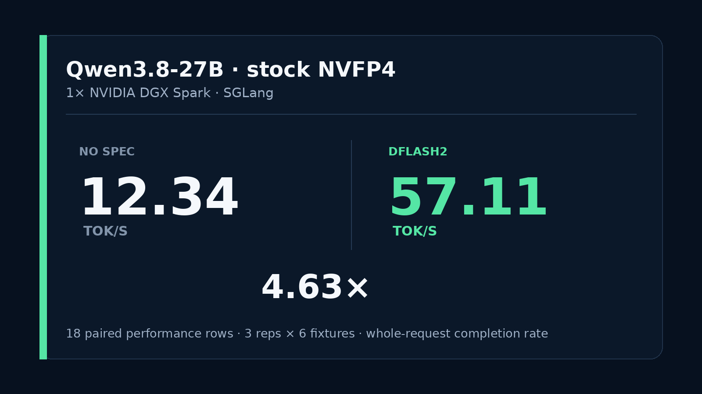

# Qwen3.8-27B stock NVFP4 + DFlash2 on one DGX Spark

A pinned SGLang recipe for serving the stock `RadixArk/Qwen3.8-27B-NVFP4` checkpoint with optional DFlash2 speculative decoding on one NVIDIA GB10 system.



## Measured comparison

One fixed-order paired sweep used 27 requests per arm: three repetitions across nine deterministic fixtures. Six fixture families, 18 rows per arm, formed the performance aggregate.

| Mode | Median whole-request completion rate | Automatic quality | Exact paired outputs |
|---|---:|---:|---:|
| No spec | 12.34 tok/s | 24/27 | 15/27 cross-arm |
| DFlash2 | **57.11 tok/s** | 24/27 | 15/27 cross-arm |

- Aggregate median ratio: **4.63x**
- DFlash2 final acceptance length: **3.95 tokens**
- DFlash2 final acceptance rate: **42.14%**
- Exact request payloads: **27/27 pairs**
- Minimum host `MemAvailable`: **29.66 GiB no-spec**, **27.59 GiB DFlash2**
- Swap growth during both measured arms: **0 bytes**

The tok/s metric is completion tokens divided by whole request wall time, including prefill and first-token latency. It is not post-first-token decode speed.

The frozen quality gate did not pass because its lexical prose checker rejected all three prose rows in both arms. Post-hoc inspection found both arms produced three semantically correct sentences, but the frozen result remains **24/27**, not 27/27. Code, JSON, math, reasoning, tools, and exact-copy checks passed in both arms.

Only **15/27** paired outputs were byte-identical. DFlash2 is therefore an explicit opt-in, not the default, and this repository does not claim exact numerical equivalence or broad quality parity.

## Exact stack

- Target: `RadixArk/Qwen3.8-27B-NVFP4` at `52d1adc5f38aa5ebf099c29ed7025ba34cfbb854`
- Draft: `z-lab/Qwen3.8-27B-DFlash2` at `50307d4c4cde6860d4eee73e2547cd786fe8e8a4`
- Base image: `lmsysorg/sglang@sha256:febfb971c7352570fc445c466ebd6ffc9d896024958e544a60f2137fd85856b1`
- Hardware: one NVIDIA DGX Spark or equivalent GB10, 128 GB unified memory
- Context exercised by the recipe: 262,144-token allocation, bounded benchmark prompts
- Scheduler ceiling: 10 requests, backed by 50 Mamba state slots. The pinned runtime reports five slots per request for this DFlash2 `extra_buffer` path
- Static memory fraction: 0.70. Raise it only after a local memory qualification. MiaAI-Lab's 0.90 profile uses a different dense-BF16-head target
- Container memory: 110 GiB with container swap disabled

A separate post-study concurrency smoke exercised the hardened 50-slot profile with 10 simultaneous requests. The runtime reported `max_running_requests=10` without a Mamba-cap warning; all 10 requests completed, producing 5,120 tokens in 35.03 seconds, or 146.14 aggregate tok/s. This is an operational smoke on one synthetic prompt, not part of the primary paired benchmark.

Exact artifact sizes and SHA-256 values are in [`manifests`](manifests).

## Download and verify

The downloader pins both Hub revisions, resumes partial files, preserves 20 GiB of free disk by default, and verifies every selected file against the repository manifests:

```bash
python3 scripts/download.py target --destination "$HOME/models/Qwen3.8-27B-NVFP4-52d1adc5f38a"
python3 scripts/download.py draft --destination "$HOME/models/Qwen3.8-27B-DFlash2-50307d4c4cde"
```

Set `HF_TOKEN` when required by your Hub rate limits.

## Build

```bash
./scripts/build_image.sh
```

## Serve

No-spec is the safe default:

```bash
MODEL_DIR=/path/to/target/snapshot ./scripts/serve.sh
```

DFlash2 is explicit:

```bash
MODE=dflash2 \
MODEL_DIR=/path/to/target/snapshot \
DRAFT_DIR=/path/to/draft/snapshot \
./scripts/serve.sh
```

Wait for `/v1/models`, then use the OpenAI-compatible endpoint at `http://127.0.0.1:8001/v1`.

Stop only the recipe-owned container:

```bash
./scripts/stop.sh
```

## Benchmark

The compact study runs 27 matched requests per arm, three repetitions across nine fixtures, with one fresh model load per arm. Reported tok/s is completion tokens divided by whole request wall time, including prefill and first-token latency:

```bash
MODEL_DIR=/path/to/target/snapshot \
DRAFT_DIR=/path/to/draft/snapshot \
./scripts/run_study.sh
```

The protocol is frozen in [`protocol.json`](protocol.json). Results are generated into `results/summary.json` and `REPORT.md`. Raw generations, logs, telemetry, and container inspection remain outside the public tree.

The exact clean source tree used for collection is archived at [`evidence/collection-source-c8bee1e.tar.gz`](evidence/collection-source-c8bee1e.tar.gz), with its SHA-256 and lineage in [`evidence/collection-source.json`](evidence/collection-source.json). Public-recipe hardening after collection does not rewrite the primary traces.

## Scope

This is one-host operational evidence. It does not establish universal DFlash2 speedups, exact numerical equivalence, or model-quality parity outside the included fixtures. Decode throughput, whole-request throughput, output parity, executable/semantic quality, and safety eligibility are reported separately.

## Related work and attribution

- [MiaAI-Lab/Qwen3.8-27B-SGLang-DGX-Spark](https://github.com/MiaAI-Lab/Qwen3.8-27B-SGLang-DGX-Spark) established the GB10 serving scaffold, DFlash2 compatibility-overlay lineage, quantized-`lm_head` handling, and workload-dependent measurement notes used here. The compatibility lineage is pinned as `c90d8c34cf795185ee8de736b7ded9bca3fe0de1`.
- MiaAI-Lab's current default target is `RadixArk/Qwen3.8-27B-NVFP4-BF16-LMHead`. This recipe and its measurements use the fully packed stock `RadixArk/Qwen3.8-27B-NVFP4`, so the reported rates are not directly interchangeable.
- MiaAI-Lab's canonical DFlash table reports a two-call net-decode estimate. This repository reports whole-request completion tok/s from matched request payloads. Treat them as different clocks.
- SGLang provides the serving runtime and DFlash2 integration. z-lab/Inco AI provides the DFlash2 draft. RadixArk provides the NVFP4 target.

## Licenses

Repository scripts are MIT licensed. The copied SGLang compatibility modules retain their Apache-2.0 headers and license. Model artifacts are not included and retain their upstream licenses.
