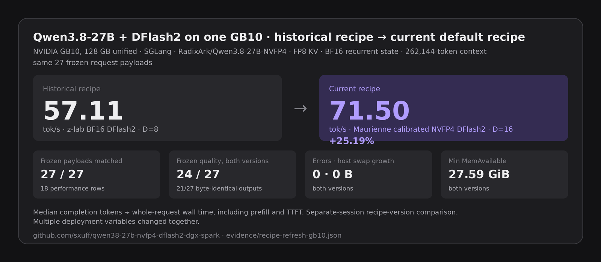

# Qwen3.8-27B stock NVFP4 + DFlash2 on one DGX Spark

A pinned SGLang recipe for serving the stock `RadixArk/Qwen3.8-27B-NVFP4` checkpoint with DFlash2 speculative decoding on one NVIDIA GB10 system. The calibrated NVFP4 DFlash2 drafter with `D=16` is the default. `D=8`, the original BF16 drafter, and no-spec mode remain explicit rollback options.

This repository is a DFlash2 operating-point refinement of [MiaAI-Lab/Qwen3.8-27B-SGLang-DGX-Spark](https://github.com/MiaAI-Lab/Qwen3.8-27B-SGLang-DGX-Spark), which established the single-GB10 SGLang scaffold and concurrency-aware GDN/Mamba pool pattern. MiaAI-Lab's current main profile uses native MTP/EAGLE. This recipe uses the calibrated Maurienne NVFP4 DFlash2 drafter at `D=16`.

## Current recipe result



On the same frozen 27 request payloads, the current default recipe measured **71.50 tok/s** median whole-request completion throughput versus **57.11 tok/s** for the historical original DFlash2 recipe, a **25.19% increase**.

| Recipe version | Drafter | D | Median whole-request tok/s | Frozen quality | Exact visible outputs |
|---|---|---:|---:|---:|---:|
| Historical original | z-lab BF16 DFlash2 | 8 | 57.11 | 24/27 | reference |
| **Current default** | **Maurienne calibrated NVFP4 DFlash2** | **16** | **71.50** | **24/27** | **21/27 vs historical** |

- Hardware: one NVIDIA GB10
- Target: the same stock `RadixArk/Qwen3.8-27B-NVFP4` revision
- Frozen request payload matches: **27/27**
- Performance denominator: **18 rows** across six fixture families
- Runtime errors: **0** in both recipe versions
- Host swap growth: **0 bytes** in both recipe versions
- Minimum host `MemAvailable`: **27.59 GiB historical**, **27.59 GiB current**

This is a measured recipe-version comparison collected in separate sessions, not a single-variable ablation or a variance estimate. The runtime image, draft artifact and quantization, DFlash depth, Mamba pool, and server-seed pinning changed together. See [`evidence/recipe-refresh-gb10.json`](evidence/recipe-refresh-gb10.json) for all 27 row hashes and exact rates.

## Supporting evidence

The current recipe result above is the README headline. Earlier experiments remain available as supporting evidence, but they use different protocols and are intentionally not displayed as competing result cards:

- [`evidence/dflash2-depth-sweep-gb10.json`](evidence/dflash2-depth-sweep-gb10.json): calibrated NVFP4 drafter depth sweep
- [`evidence/nvfp4-drafter-gb10.json`](evidence/nvfp4-drafter-gb10.json): matched original-BF16 versus calibrated-NVFP4 drafter study
- [`results/summary.json`](results/summary.json): historical no-spec versus original DFlash2 study
- [`evidence/public-default-validation.json`](evidence/public-default-validation.json): generation-tested current default and restoration receipt
- [`evidence/prose-checker-results.json`](evidence/prose-checker-results.json): frozen lexical-checker disagreement receipts

See [`REPORT.md`](REPORT.md) for the complete historical measurements and their separate metric boundaries.

## Exact stack

- Target: `RadixArk/Qwen3.8-27B-NVFP4` at `52d1adc5f38aa5ebf099c29ed7025ba34cfbb854`
- Default draft: `maurienne-ai/Qwen3.8-27B-DFlash2-NVFP4-RTNcal` at `bd7a934213c47a9e7ef69eef36bb3325f47fd1f1`, ModelOpt FP4, `D=16`
- Rollback draft: `z-lab/Qwen3.8-27B-DFlash2` at `50307d4c4cde6860d4eee73e2547cd786fe8e8a4`
- Base image: `lmsysorg/sglang@sha256:febfb971c7352570fc445c466ebd6ffc9d896024958e544a60f2137fd85856b1`
- Hardware: one NVIDIA DGX Spark or equivalent GB10, 128 GB unified memory
- Context exercised by the recipe: 262,144-token allocation, bounded benchmark prompts
- Scheduler ceiling: 10 requests, backed by 50 Mamba state slots. The pinned runtime reports five slots per request for this DFlash2 `extra_buffer` path
- Static memory fraction: 0.70. MiaAI-Lab's current main profile uses a different speculative path and Mamba strategy, so its memory settings are not treated as interchangeable.
- Container memory: 110 GiB with container swap disabled

A separate post-study concurrency smoke exercised the hardened 50-slot profile with 10 simultaneous requests. The runtime reported `max_running_requests=10` without a Mamba-cap warning; all 10 requests completed, producing 5,120 tokens in 35.03 seconds, or 146.14 aggregate tok/s. This is an operational smoke on one synthetic prompt, not part of the primary paired benchmark.

Exact artifact sizes and SHA-256 values are in [`manifests`](manifests).

## Download and verify

The downloader pins both Hub revisions, resumes partial files, preserves 20 GiB of free disk by default, and verifies every selected file against the repository manifests:

```bash
python3 scripts/download.py target --destination "$HOME/models/Qwen3.8-27B-NVFP4-52d1adc5f38a"
python3 scripts/download.py draft-candidate --destination "$HOME/models/Qwen3.8-27B-DFlash2-NVFP4-RTNcal-bd7a934213c4"
```

Set `HF_TOKEN` when required by your Hub rate limits.

## Build

```bash
./scripts/build_image.sh
```

## Serve

Launch the default DFlash2 mode:

```bash
MODEL_DIR=/path/to/target/snapshot \
DRAFT_DIR=/path/to/calibrated-nvfp4-draft/snapshot \
./scripts/serve.sh
```

Keep the calibrated drafter but return to `D=8` explicitly:

```bash
DRAFT_TOKENS=8 \
MODEL_DIR=/path/to/target/snapshot \
DRAFT_DIR=/path/to/calibrated-nvfp4-draft/snapshot \
./scripts/serve.sh
```

Use the original BF16 drafter explicitly:

```bash
DRAFT_VARIANT=baseline \
MODEL_DIR=/path/to/target/snapshot \
DRAFT_DIR=/path/to/original-bf16-draft/snapshot \
./scripts/serve.sh
```

Use the no-spec control or fallback explicitly:

```bash
MODE=no-spec \
MODEL_DIR=/path/to/target/snapshot \
./scripts/serve.sh
```

Wait for `/v1/models`, then use the OpenAI-compatible endpoint at `http://127.0.0.1:8001/v1`.

Stop only the recipe-owned container:

```bash
./scripts/stop.sh
```

## Benchmark

The compact study runs 27 matched requests per arm, three repetitions across nine fixtures, with one fresh model load per arm. Reported tok/s is completion tokens divided by whole request wall time, including prefill and first-token latency:

```bash
MODEL_DIR=/path/to/target/snapshot \
DRAFT_DIR=/path/to/draft/snapshot \
./scripts/run_study.sh
```

The protocol is frozen in [`protocol.json`](protocol.json). Results are generated into `results/summary.json` and `REPORT.md`. Raw generations, logs, telemetry, and container inspection remain outside the public tree.

The exact clean source tree used for collection is archived at [`evidence/collection-source-c8bee1e.tar.gz`](evidence/collection-source-c8bee1e.tar.gz), with its SHA-256 and lineage in [`evidence/collection-source.json`](evidence/collection-source.json). Public-recipe hardening after collection does not rewrite the primary traces.

## Scope

This is one-host operational evidence. It does not establish universal DFlash2 speedups, exact numerical equivalence, or model-quality parity outside the included fixtures. Decode throughput, whole-request throughput, output parity, executable/semantic quality, and safety eligibility are reported separately.

## Related work and attribution

- [MiaAI-Lab/Qwen3.8-27B-SGLang-DGX-Spark](https://github.com/MiaAI-Lab/Qwen3.8-27B-SGLang-DGX-Spark) established the single-GB10 SGLang scaffold and concurrency-aware GDN/Mamba pool pattern used here.
- MiaAI-Lab's current main profile uses the stock `RadixArk/Qwen3.8-27B-NVFP4` target with native MTP/EAGLE, FP8 KV, BF16 recurrent state, and ten running requests. This repository keeps that target and hardware lane but uses DFlash2 with the calibrated Maurienne NVFP4 drafter at `D=16`.
- The compatibility overlay remains pinned as `c90d8c34cf795185ee8de736b7ded9bca3fe0de1`. Benchmark clocks from other repositories are not treated as interchangeable with this repository's whole-request completion metric.
- SGLang provides the serving runtime and DFlash2 integration. z-lab/Inco AI provides the DFlash2 draft. RadixArk provides the NVFP4 target.
- `maurienne-ai` published and calibrated the ModelOpt NVFP4 drafter used by the default profile. The original DFlash2 architecture and source draft remain credited to Z Lab / Inco AI.

## Licenses

Repository scripts are MIT licensed. The copied SGLang compatibility modules retain their Apache-2.0 headers and license. Model artifacts are not included and retain their upstream licenses.
